**This tutorial currently uses ETS2 road types and prefabs. Please contribute to the guide with an ATS version if you are able.**

# Tutorial 2 --- Creating a basic map

This tutorial will introduce you to the basics of road placement in the map editor, and guide you through the creation of a small city block.

1. [Open the editor](#section1)
2. [Draw a road](#section2)
3. [Change the road properties](#section3)
4. [Extending the road](#section4)
5. [Road adjustment basics](#section5)
6. [Prefabs](#section6)
7. [City Roads](#section7)
8. [Expanding the city](#section8)
9. [Finishing the map](#section9)

<a name="section1"></a>
## 1. Open the Editor

Once you've followed the instructions in [Tutorial 1](1_setup.md), you can now launch your game. Once you've passed the opening logos and reached the 'launchpad' screen, you can open your terminal, using the _tilde_ key. (¬, found under the Esc key)  Please note that this is the recommended point at which to launch the editor. It is not recommended to launch the editor after loading a profile;  you should launch it at the point where you would normally be choosing a profile.

The developer console should appear. To open the editor, type ```edit``` and press enter. After a few seconds the editor window should appear, with a car model on the screen. Press _tilde_ again to close the developer console.


<a name="section2"></a>
## 2. Draw a road

Look on the top bar of the editor. Ensure the 'Item type' is set to road, then press the _New Item_ button. A new window will appear.


This dialog allows us to choose a road to place in the editor. Press the magnifying glass _content browser_ button to the right of 'Road Type'.


You guessed it, another window. This is the content browser, where we can inspect all of the assets in the game. For now, concentrate on the central pane, which will currently show thumbnails for all the road types in the game.

Find a road type named ```City 2 lanes 1m offset```, this is the 4-lane road type that is found in the city areas throughout Euro Truck Simulator 2. Double click on the thumbnail for this road type, the road type in the _new item_ window should now be updated.

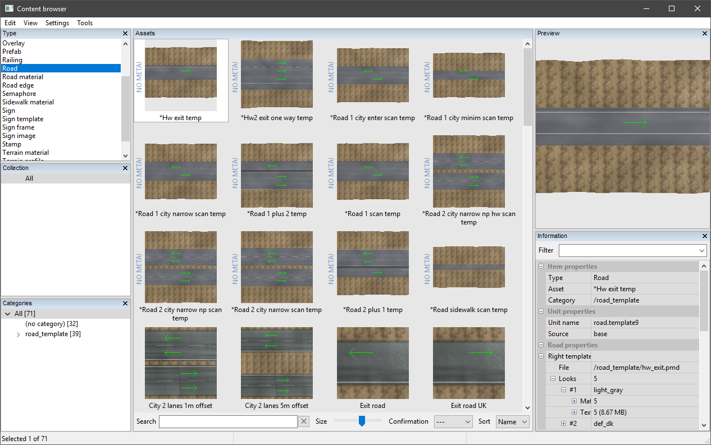

Once you've selected the road type, go back to the main editor window. Click above the car model to create a start node, then once more below the car, a small section of road should appear. Press Esc to finish placing road.

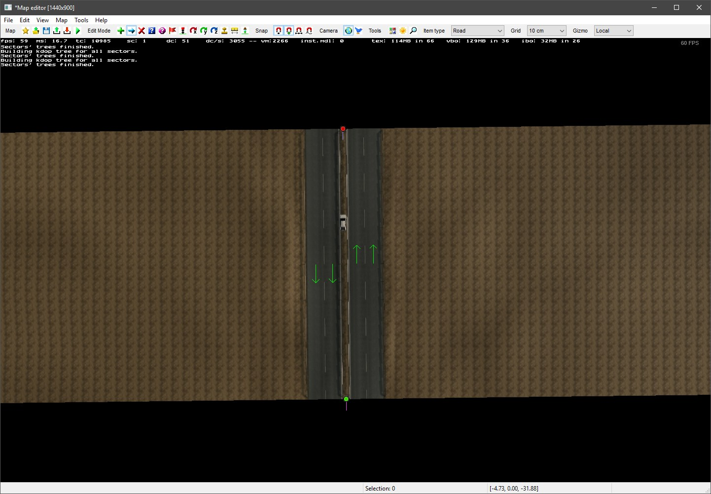

<a name="section3"></a>
## 3. Change the road properties

Return to the top bar of the editor and select the _Item Properties_ button. Then, double-click the red road node that we placed.


A new and slightly frightening window will appear. This window lists all of the properties for the road segment we just selected. Despite the huge number of boxes on this window, it is straightforward to understand with a little familiarisation.

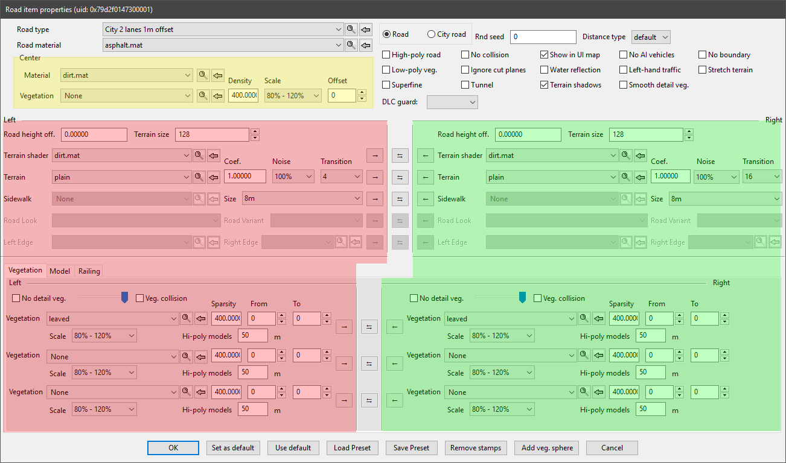

The dialog is split into options for the left and right terrain of the road, as well as the central reservation. Later we'll also look at the main road properties found at the top-left and top-right of the window.

The road currently looks a little barren. Have a play around with the various properties highlighted above and see what each one does. Then, copy the properties listed below to get a typical setting.

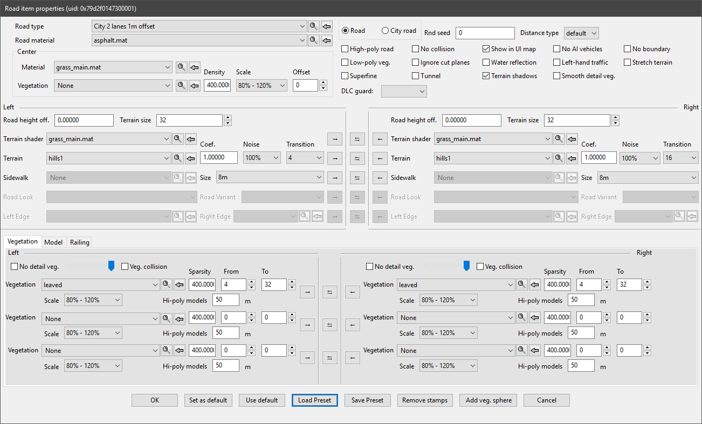

We'll also add crash barriers to this road. Move to the railings tabs and add ```center_crash_barrier_1m.pmd``` and 1 ```outer_crash_barrier_cityroad.pmd```. These models are symmetrical, so they can be placed in either the left or right side.


Once you've finished setting the properties for the road, **press _Set as default_**, so that this road is used for all new placement, then press _OK_ to save the changes to this road.

Back in the editor window, press the C key to switch to the flying camera. Your road should look something like the following image.

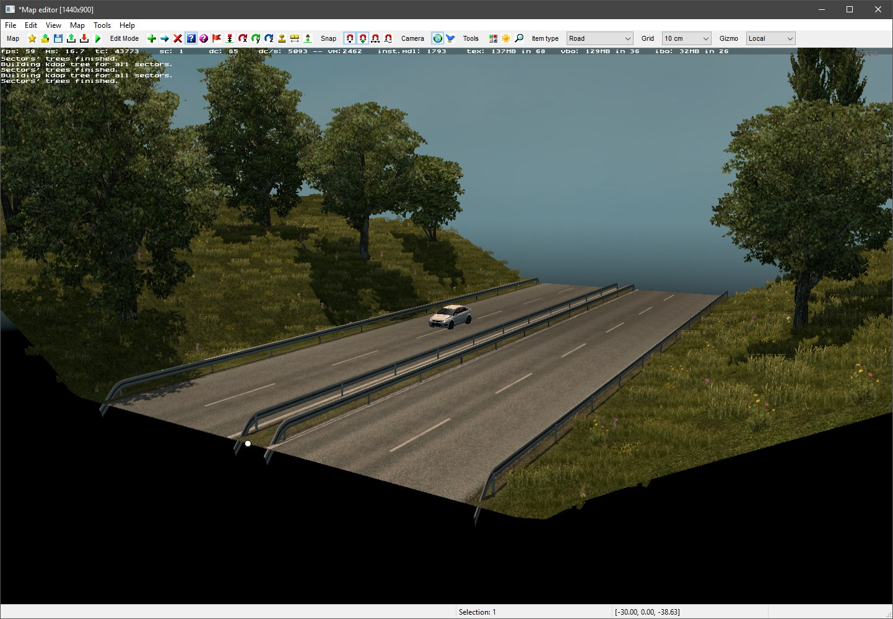

Press C again to switch back to the Plan View (overhead) camera.  Get used to this switching between views, as you'll need to use it a lot.  If you click on a location on the map while in Plan View, then when you switch to flying camera you should find yourself hovering over or under that spot.  

<a name="section4"></a>
## 4. Extending the Road

This road will lead away from what will become a small city block. We'll extend this road to turn to the west, becoming the end point of this map.

Return to the add item mode, ensuring the item type is still road. Click on the (bottom) green road node, then place two additional nodes, as shown. Press Esc again to finish placing segments.  Note that *you must have Snap To Node turned on* (little buttons with magnet symbols in centre of top toolbar) for this to work.  If you do not have Snap To Node turned on, you'll never be able to join or extend road segments.

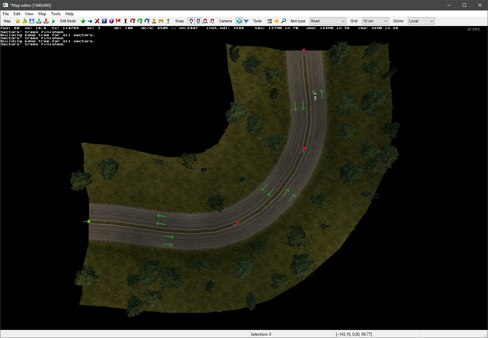

<a name="section5"></a>
## 5. Road adjustment basics

### Moving the road

There are two editor modes for moving placed objects and nodes. The _Move Item_ mode will allow you to click and drag a placed node, whereas the _Node Properties_ mode will allow us to set specific positions and change the bend angles.

 

Switch to the Node Properties mode and double-click the first (top-most) node. Set this first nodes position to ```0, 10, 0``` as shown below, then click OK.

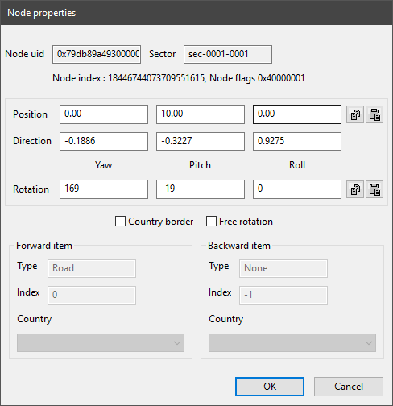

There are 3 remaining nodes (including the _forward_ green node). Set the following positions for those nodes.

```
   0,  10,   60
 -40,  10,  100
-100,  10,  100
```

### Making neater turns

By default, the angle between nodes is chosen automatically. This produces smooth curves in many situations, but tends to produce odd results on precise turns such as this right angle.

Open the second node again in Node Properties mode. we can set angles manually, by first **ticking the _Free rotation_ checkbox**, then entering our own rotation in the yaw pitch and roll boxes. Round the yaw values to the nearest 90 degrees. In this case the second and third node should use the following angles.

```
180  0  0
 90  0  0
```

Your turn should now be a lot neater. You should open the second node in _Item_ Properties mode and tick the checkbox named _High-poly road_, the result on the corner piece should be quite noticeable.

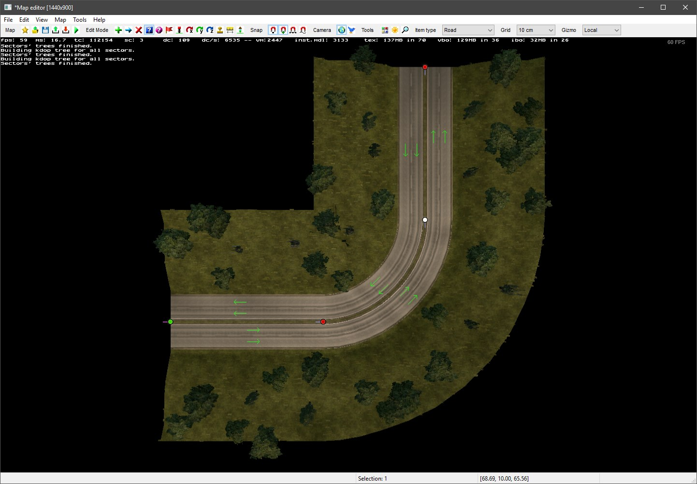

<a name="section6"></a>
## 6. Prefabs

At the top of this current road, we'll begin creating our city block. City roads are a different type of road, so we'll use transition piece to connect the two. Interchanges, roundabouts and transition pieces are all _prefab_ type objects in the SCS game engine.

Open the content browser (shortcut F2) and change the _type_ in the top-left box to prefab. Then, search for the ```road sidewalk end``` prefab. Ensure you've found the correct one, and not a ```4m``` or ```uk``` variant. Double-click on the thumbnail to begin placing the prefab.

Place the prefab above the top road node. Ensure the direction is correct, with the sidewalk at the top of the prefab, then grab the bottom (green) node of the prefab in Move Item mode, and drag it to the red node of the road. It should snap into place.

You can add grass sides to this prefab now if you wish. As with the road, open the prefab in Item Properties mode to do this. Your prefab should now look like this.

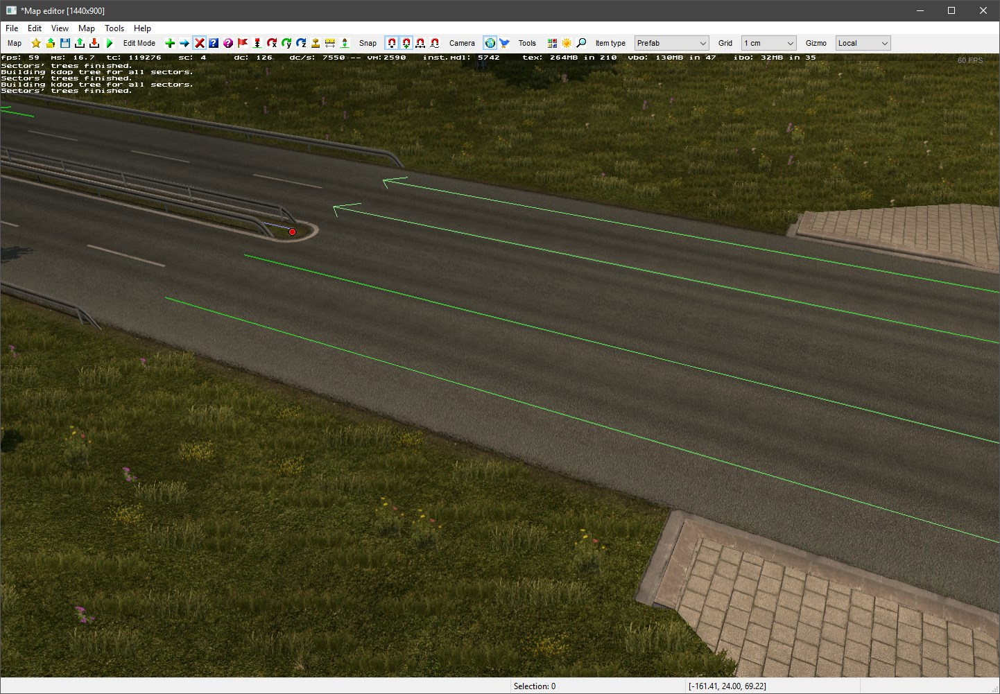

<a name="section7"></a>
## 7. City roads
City roads are similar to regular roads, except they have sidewalks on which pedestrians may appear. To create a city road, change the item type at the top of the editor back to _road_, then press the New Item button again.

The same road type should still be selected. Change the Type radio button to _City road_, then place another road above the prefab.

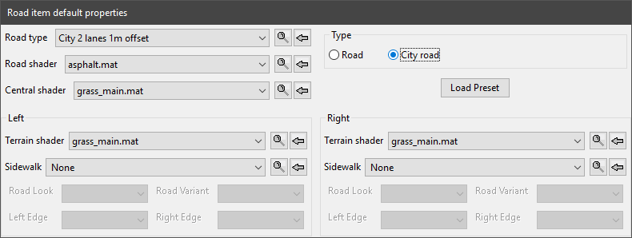

<a name="section7b"></a>
### Road direction

You may have noticed that roads have an inherent direction, even though they are usually 2-way roads. The road you placed has two nodes. A red _rear_ node, and a green _forward_ node.

The connections we can create are limited by these node directions. Here are the basic rules.  

Road/road connections:  Road segments can be connected to one another, but *only* by connecting green to red nodes.  Also, if the two nodes are not at exactly the same altitude the connect will fail, unless you hold down Alt while selecting and connecting.  In other words:  select Move mode (M), then hold down Alt, then grab node, then drag node on top of other node.

Road/prefab connections:  A prefab can be connected to a road segment using green/green nodes as well as green/red.

Red/red connections will never work.

| **Node 1** | **Node 2** | **Valid Connection?** |
| :---: | :---: | --- |
| Red | Green | Yes |
| Red | Red | No, never connects |
| Green | Green | Only prefabs/roads |

You can see that prefabs may be useful in cases where you have painted yourself into a corner and have two red road nodes that you cannot connect.

#### I can't connect this!

We'll cover this in more detail in a later tutorial, but occasionally you'll come across an intersection that you can't seem to connect, due to which node the prefab chooses as the rear node. Delete the intersection and return to the new item dialog. Use the _Origin_ dropdown box to change which node is the rear node.

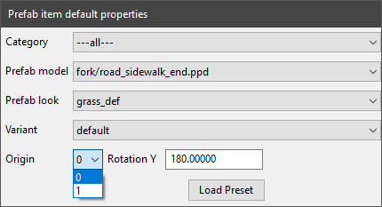

### Configuring your city road

Ensure your road has the correct direction, with the green node at the south, then connect it to the prefab. Set the position of the rear node to ```0,  10,  -200```, so that it remains straight.

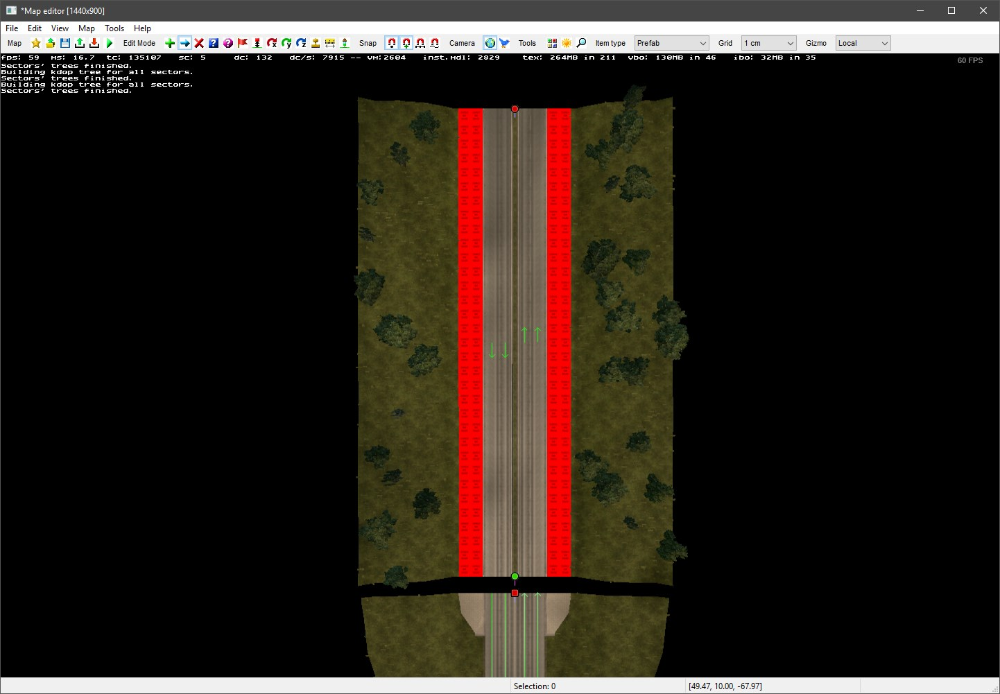

open the road segment in item properties mode. We need to set the sidewalk texture to match the prefabs texture, get rid of the outer crash barrier, and we can also get rid of the terrain within the city bounds. Your city road segment should have properties like the following image.

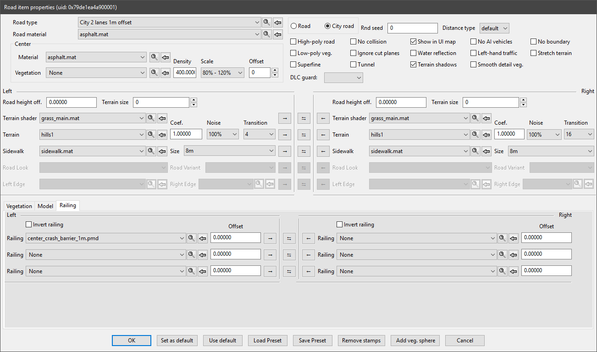

<a name="section8"></a>
## 8. Expand the city

Your map should currently look like this.

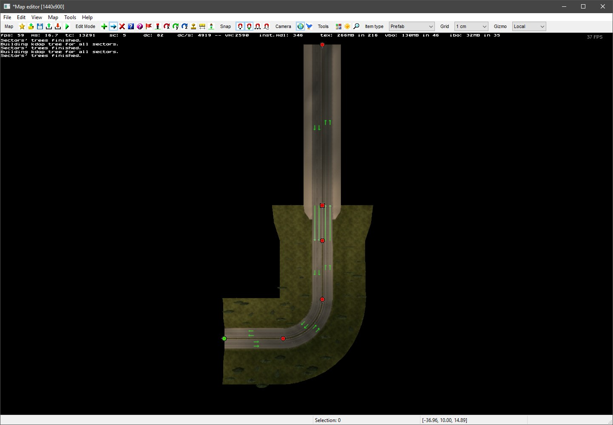

Use city roads and prefabs to expand this map to something like the following:

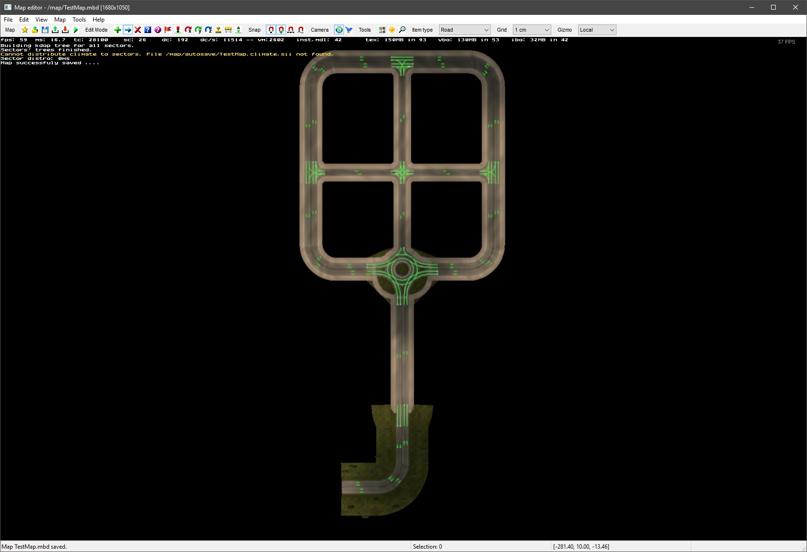

We've covered the basics for road placement, and the rest of this city follows the same processes. Here are some hints to get you started.

- The roundabout used is ```r2xr2xr1 sw roundabout```
- The central roads are 2-lane roads. You'll need to use the road type ```Road 1 lane broken``` for these segments.
- To find a suitable T-junction prefab:
  * Search for ```road2 road1 t``` in the content browser. These are the two road types that you are connecting.
  * Ensure your chosen prefab has one road1 connection and two road2 connections.
  * Remember to choose one with an 8m sidewalk --- not _4m_ --- on _all_ sides.
- The cross junction can be found in a similar manner, this one uses road1 type roads only, so the name will include ```road1 x road1```.
- If you run into trouble connecting prefabs, check [Step 7](#section7b), to ensure your prefab origins are correct.

<a name="section9"></a>
# 9. Finishing the map

Once you've created your square, you've completed this tutorial and are ready to save and test your map.

Firstly, ensure the start car is placed in a sensible location. Select the _Place Start_ mode button (or hit S key), then click to place the car model in a sensible location. *Hint:* if you hover the mouse over a node after hitting S, the start car will be placed at the same elevation as that node (match height).  Then, go to ```File > Save As``` and save your map. I have called mine ```TestMap.mbd```.

Proceed to the next tutorial to learn how to test the map, as well as how to load and continue editing it.

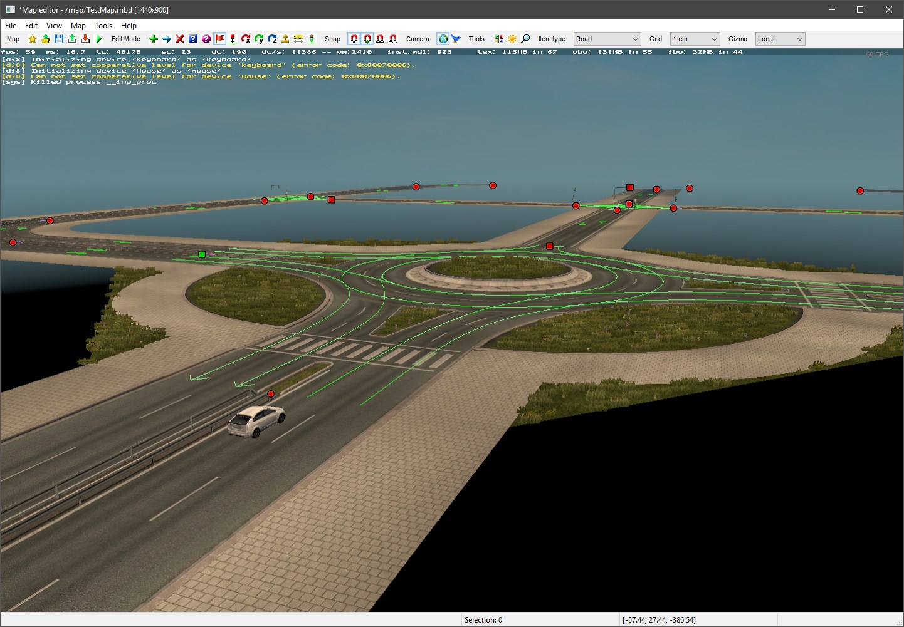

[<- Tutorial 1 - Basic Editor Setup](1_setup.md) --- [Tutorial 3 - Loading and testing your map ->](3_testing.md)
