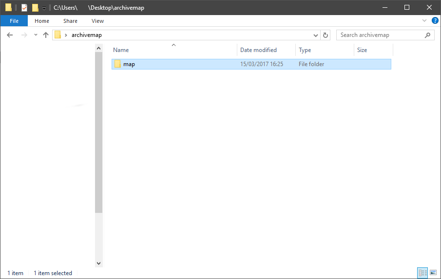
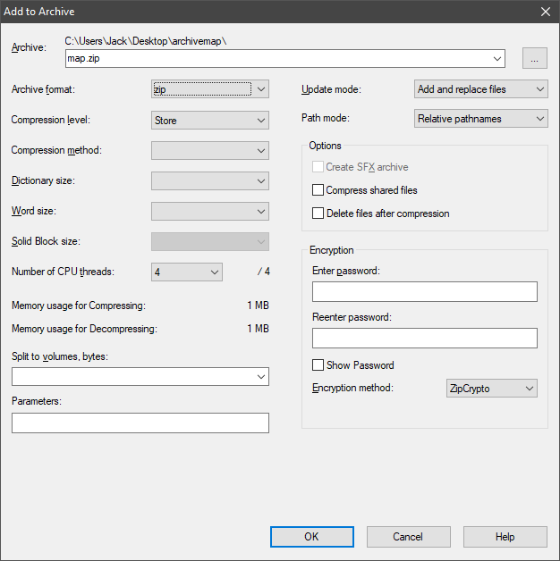
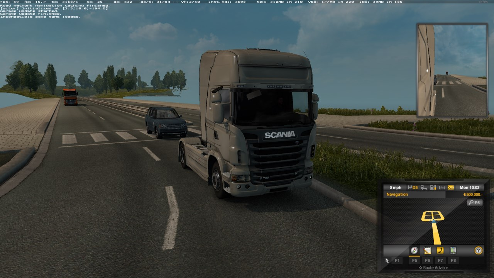

# Tutorial 3 --- Loading and testing your map

This tutorial briefly covers the process of packing your maps to be tested or loaded, then briefly explains why this process is a little more convoluted than one might expect.

1. [Setting up archive files](#section1)
2. [Mod description files](#section2)
3. [Creating the .scs Archive](#section3)
4. [Loading the map](#section4)
5. [When do I need to update the archive?](#section5)

<a name="section1"></a>
## 1. Setting up archive files

Creating an .scs Archive

Once you've saved your map in the editor, we will need to gather some of the created loose files and place them in a specific type of ZIP archive.

Firstly, **create** a folder on your desktop called ```archivemap``` or something similar. This folder will be used to ensure the archive structure matches that of the games executable _base_ folder. As such, you now need to **create** the same ```map``` folder as you did in tutorial 1 here.

Find the loose map files in your executable folder --- ```C:\Program Files (x86)\Steam\steamapps\common\Euro Truck Simulator 2``` by default --- under the ```base\map``` folder that you set up in tutorial 1.

Your map folder will currently look something like this

```
autosave
TestMap
TestMap.bak
TestMap.mbd
TestMap.set
```
**copy** _TestMap.mbd_ and the _TestMap_ folder to the map folder on your desktop. Your desktop folder should now look like:

```
archivemap
  map
    TestMap
    TestMap.mbd
```

Please note that the top level folder *must* be called "map", and the structure *must* look exactly as you see it here.  You cannot name the top level folder anything other than "map", and you cannot add further levels of hierarchy.  The zipfile contents must be *map/TestMap.mbd, map/TestMap*, and so on.

<a name="section2"></a>
## 2. Mod description files (optional)

It's a good idea to set up the mod description files now, as they can be reused each time you update your archive. The mod description appears in the in-game mod manager, and consists of three files:

- ```manifest.sii``` the main manifest file.
- ```description.txt``` (optional) a text description of the mod, linked to from the manifest file.
- ```mod_icon.jpg``` (optional) a thumbnail image for the mod, linked to from the manifest file.

### manifest.sii

The manifest file is the main file for the mod description. it is simply a text file with a custom file extension. A simple manifest file for your mod would be:

```INI
SiiNunit
{
# ".package_name" does not matter as the dot at the beginning of the file means that this unit is anonymous.
# Please keep this form to not make any conflicts with other mod packages (name collisions).
mod_package : .package_name
{
        # Package version can be any string with any length.
        package_version: "0.1"

        # Display name can be any string with any length.
        display_name: "The test map"

        # Author can be any string with any length.
        author: "scsmoddingguide.github.io"

        # Categories is an array of strings.
        category[]: "map"

        # Icon inside the root directory of the mod.
        # icon: "mod_icon.jpg"

        # Description file inside the root directory of the mod.
        description_file: "description.txt"
}
}
```

Note that the icon setting has been commented out with a # in this case, in case you do not wish to create one. More information on creating manifest files can be found on the [SCS modding wiki](http://modding.scssoft.com/wiki/Documentation/Engine/Mod_manager#Using_the_manifest).

### description.txt
A standard text file containing the mod description. Extra [formatting tags](http://modding.scssoft.com/wiki/Documentation/Engine/Mod_manager#Description_of_your_mod) can be added.

### mod_icon.jpg
The mod icon must be a JPEG image with the exact size of 276px by 162px.

<a name="section3"></a>
## 3. Creating the .scs Archive



Ensure you have returned to the archive map folder, then **Create** a zip archive of the map folder. To do this with 7-Zip, do ```Right click --> 7-Zip > Add to archive...```. Ensure the _Archive format_ is set to ```zip```, and the _Compression level_ to ```Store```, (no compression) and change the filename to ```TestMap.scs```.



Once you have produced the .scs archive, you need to **move** it to your user folder -- by default located at ```C:\Users\<username>\Documents\Euro Truck Simulator 2```. Inside this folder, there should be a folder named ```mod```, so create one if it isn't there already. place the .scs archive inside the mod folder.

<a name="section4"></a>
## 4. Loading the map

Launch the game again. You do _not_ need to enable the mod in the launchpad mod manager, the editor will read _everything_ in the mod folder. **Open** the editor, this time placing the map name in the command too, i.e. ```edit TestMap```. Ensure the capitalisation is the same as the editor filename. Your map should now load back into the editor, and you can press the _Run Map_ button to test the map.

**hint:** On Jack's machine, the loading screen does not appear immediately. ALT+TAB out and back in and the game should load nearly instantly.  De's version did not have this issue.

**warning:** There's a tempting "Run" button in the editor toolbar.  Beware of it.  Remember that this button runs the *last loaded version of the game* (from your mod file), **not** the current (editing in progress) version of the map you are seeing in the editor window.  You may be tempted to Save, then Run -- and if you've used other game editors like Unity, this makes perfect sense -- but this would be a bad idea because SCS Map Editor does not work like Unity.  If you do this, the game will run the version of the map it loaded at startup, and if you Save again after that, you'll save the version last loaded at startup... and lose any changes you made since then.  That Run button is only useful right after launch, to have a look at what you last saved (and archived and installed as a mod file).  Just get used to it:  *you will have to quit, repackage mod, and relaunch the game every time you want to demo your work.*



<a name="section5"></a>
## 5. When do I need to update the archive?

Unlike most programs, the SCS game engine editor can't load what you've just saved. This is because the editor can only access the data currently loaded by the game; that means the game's base files, plus any mods.  And this loading of base files and mods only takes place at startup.

This means that **each time** you wish to load a map to continue work on it, you must update the archive (mod file) with the latest version of the map found in the executable base/map folder, and restart the game to reload your archive (mod file). The same applies for testing the maps: even if you have a modified version of the current map current in your editor, it will revert to the last archived version when you run the map to test it.

It is quite important to understand this, so let's go through it one more time.  The map file you are diligently editing and saving is found in the install hierarchy.  But you cannot run/test your map until it has been loaded by the game engine *at startup*.  The game engine cannot load a map mod after the initial startup phase is over, so map mods cannot be reloaded while you are editing.  And map mods are not loaded from base/map in the install hierarchy;  they are loaded from .scs files in the user mod folder.  So if you want to test your map mod, you have to go through this workflow:

0. use map editor to make changes to your incredibly cool map
1. in map editor, save changes to map file (updates base/map files in the *install/executable hierarchy*); exit game
2. copy mbd file and map sector folder from install/exec hierarchy to your working "map" folder (anywhere you like)
3. re-create your zipfile (archive) by zipping that working "map" folder, and rename the .zip file to .scs
4. put the new .scs file in your "mod" folder (in the *user config hierarchy*), replacing the old one
5. restart the game

It is quite easy to write a .bat file, Makefile, or shell script that will do steps 2-4 for you with a single command.  Here is one example of such a script (bash).  (I installed the MSYS package on my Windows system to get a Unix-like scripting/shell environment with familiar tools.)  A trivial script like this can save you a lot of tedious, repetitive typing or mousing.
```
$ cat mapit.sh
#!/bin/sh.exe

# target saved mapfile rootname is arg 1

ETS2MAP="C:/Program Files (x86)/Steam/steamapps/common/Euro Truck Simulator 2/base/map"
MYMAP="C:/Users/moi/Documents/Euro Truck Simulator 2/MyMap"
MYMAPD="C:/Users/moi/Documents/Euro Truck Simulator 2/MyMap/map"
MYMOD="C:/Users/moi/Documents/Euro Truck Simulator 2/mod"
ZIP7="C:/Program Files/7-Zip/7z.exe"

cp -f "$ETS2MAP"/$1.mbd "$MYMAPD"
cp -rf "$ETS2MAP"/$1 "$MYMAPD"
cd "$MYMAP"
ls
"$ZIP7" a -tzip -mx0 map.zip map
mv map.zip $1.scs
cp -f $1.scs "$MYMOD"
```
Sample run of script:

```
$ ./mapit.sh Map2
MyMap.scs  map

7-Zip [64] 16.04 : Copyright (c) 1999-2016 Igor Pavlov : 2016-10-04

Scanning the drive:
3 folders, 34 files, 86504 bytes (85 KiB)

Creating archive: map.zip

Items to compress: 37


Files read from disk: 34
Archive size: 92432 bytes (91 KiB)
Everything is Ok
```
This script is a bit too simpleminded for production work;  it uses only one MyMap folder with one 'map' subfolder, with just one manifest and description file for all maps I'm currently building.  I'm building throwaway maps as tutorial exercises, so this doesn't matter.  The script could easily be rewritten with a little more functionality and another argument, so that the "MyMap" dir was selectable/creatable on the fly.

[<- Tutorial 2 - Creating a basic map](2_firstmap.md) --- [Tutorial 4 - Decorating your map ->](4_decorating.md)
