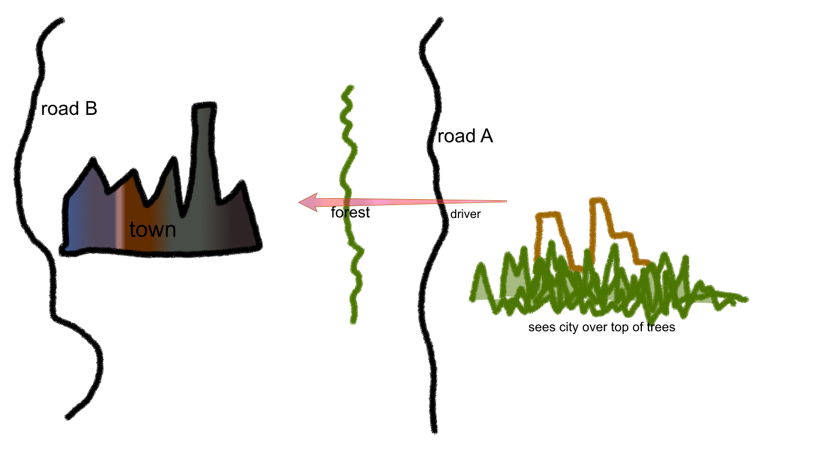
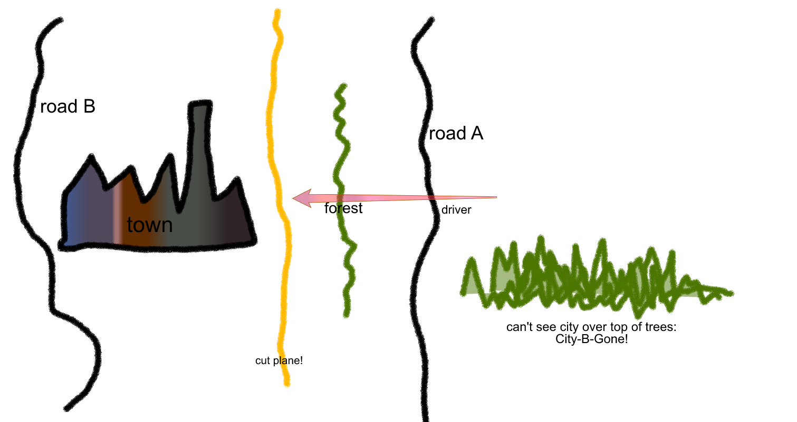

## Fooling the Player: the art of illusion
### Introducing Terrains, Bezier Patches, High-Poly attribute, and Cut Planes

#### Sssh!  don't let them know it's just a model

A large part of the art of decorating your world is to camouflage any evidence that it is a model.  You don't want the user to catch sight of the void beyond the map, for example;  when they are near the edges of the world, you need to put up visual barriers so that they won't see the edge.  As you fit your roads and prefabs together, you'll find there are inevitable gaps in the terrain where the existential void (or the underlying water plane) shows through, or the terrain wrinkles in an unrealistic way.  These are illusion breakers, and you need to hide them.

You can minimise ugly spots by reducing roadside terrain size on the inside of curves, and by avoiding very abrupt changes in terrain profile.  Try making a right angle bend in your road and increasing the inside curve terrain size to a large number like 100, and you'll immediately see the "fan shaped" wrinkling;  reduce the size and you'll have less ugliness.  But eventually you'll paint yourself into a corner where raw terrain edges are visible, or terrains don't meet in a nice tidy way and there are holes, or the surface topology gets weird and obviously unnatural.

These booboo spots can be hard to see from above (the Plan view) so it's very important to fly around with the free cam looking at your world from the roadway, from many angles and heights.  In Plan view, always be suspicious of any hard linear edge in the landscape below.  It's probably a free-floating terrain edge that needs to be hidden.

There are several ways to hide these booboos.

#### Mind the Gap!

If the gap is small enough, you may be able to hide it with a model of some kind:  a rocky outcrop, a dense thicket, some architecture, a parked vehicle...  You need to be careful of sight lines and make sure that it's hidden from all POV along nearby roads.  A raw terrain edge can be hidden with a long rocky outcrop;  a hole can be hidden by a single big rock, house, etc.  Get creative!

If the gap is a bit larger and harder to fill, you could always put up a sound wall, a line of buildings, or other visible barrier along that side of the road, so that the player simply can't see the ugly spot from the road.

If you don't want walls at that location, if the gap is part of a prefab join, or your local terrain offers long sight lines and no useful features for hiding holes, then your next best option is to stitch a non-road terrain into the picture to cover the gap.  There are two types of non-road terrain you can use as patches:  one is just called Terrain and the other is called Bezier Patch.  They are quite different animals. 

A *Terrain* is just a rectangle of terrain with two handles on one edge.  To create one, select Terrain from the object type menu, and use the E key or the plus-sign button to go into "new object" mode.  Click and drag to draw a line that will define one edge of your new terrain.  You can adjust its other dimension later from its Properties.

You can glue your new terrain to a road segment -- with the same Alt-Click-Drag move that you use to glue road segments together -- or you can position it free-floating.  If you glue it to a road segment it will, usefully, adopt the profile of that road segment (bank, flat, ditch, whatever).  So it's very handy for filling in gaps at overpasses, as seen in this very informative tutorial video from ProMods, [Building Better Bridges](https://youtu.be/C-eqesW3LlM)

A roadless Terrain is really just a road segment without the paving;  that's why it has the same two handles as a road segment.  It's not very flexible, and it wants to bond with road segments (because that's what it is).  That's why it's so useful at bridge heads and ramps and such like, to mask the gaping hole where the road terrain ends and the prefab begins.  The other thing it's good for is a water plane:  you can give it a water texture and position it to intersect a low spot.  Be careful to keep your water plane level, though -- if you move one handle independently of the other you may end up with tilted water, which won't look right in a lake or pond!

*Bezier Patch* is a more sophisticated object:  it's a rectangle of terrain with *many* handles.  By moving these handles you can deform the patch creatively to fill odd-sized gaps and to present some nice topography for the player to enjoy.  A Bezier Patch is far more flexible than an ordinary Terrain patch, so you might be tempted to use only Bezier Patches to cover all your booboos;  but beware!  they come with a rendering cost that will impact game performance if you use too many of them within the render area.  Use them thoughtfully.

Another area where you may spot a gap that would be inappropriate to fix with these basic tools is at tight bends in your roadway.  You may see places where the roadway and the median strip, or the edge strips, don't quite stitch together at a bend -- and you can see the Void or the water plane through the gap.  Usually the reason is that the poly count on this segment is not high enough to prevent a hard polygonal shape, and you'll notice that your railings or stripes look a bit jaggy.  The solution to this is to set the road segment to a higher poly count, using the Properties window.  This should smooth out the jaggies and close any gaps.  If you still have gaps, try some strategically placed small vegetation.

#### I shouldn't be able to see that from here...

Even after achieving a seamless world surface, you still need to preserve the illusion of distance and spaciousness.  This is a more sophisticated level of map design, but worth mentioning here so you can bear it in mind as your map becomes more complex and possibly more crowded.  The scale factor of the map (1:19 outside cities and 1:3 inside cities, in ETS2) means that roads may be closer together than they should be in real life;  a driver on Road A might see bits of a city on Road B that IRL should not be visible from there, and that will be immersion-breaking.

How can this be avoided, without moving the roads to a realistic distance apart, thus generating a map so large that no game engine could run it?  The editor provides a special object called a *Cut Plane* which solves exactly this problem.  A cutplane is an "invisible visual barrier".  You can't see the cutplane itself, and you can't see anything that is on the far side of it from your POV location.  Cutplanes can be one-sided (see-through one way but not the other) or two-sided (barrier in both directions).  They don't have to be a mere straight wall, either;  they can zigzag all over the landscape selecting things to display to a viewer on one side or the other.

So, if you put a cutplane between the forest beside Road A and the city just beyond, the driver on Road A will only see the forest and the empty sky -- not the city towers peeking over it.  The city will seem as far away as it should be IRL. 

Thus the cutplane can be used to preserve that illusion of space, of a map size far greater than the actual layout.  It also saves the graphics engine (at runtime) from having to render all the objects behind the cutplane, thus improving performance.  Even if objects are not visible to the user (being screened by other models and objects in between), the engine will still try to render them.   But if you know that bits of the scenery absolutely cannot be seen from Location A, you can throw in a cutplane to hide them from the rendering engine at runtime, and thus improve game performance for your player.

The deployment of cutplanes is a fairly complicated topic and the best tutorial on it that I've yet found is ProMods again:  [Cut Planes](https://youtu.be/7IFJttG9TRc) 

#### In Summary / Next Steps

It's worth emphasising just one more time, how essential it is for you as a map builder to cover your tracks, hide all the seams, never let the user see "backstage".  You need to preserve the immersive illusion, and nothing breaks it faster than a visible hard terrain edge, a levitating object, a flagrant scale error, or a hole in the world.  These can be hard to detect from above;  take the time to fly around with the free cam checking carefully for telltale "world under construction" evidence -- and hiding it.

So now you know how to build a road network, decorate it, and patch the gaps where you glued your map together from the lego kit that is the Map Editor.  At this point you might want to try a mod to the master ETS2 or ATS map (europe, or usa).  A manageable-size beginner project might be to pick an empty area of the existing map and add your own back road with some nice scenery, then try loading that mod into your playable game and see if you can find and drive on your new road.

Or, if you're feeling ambitious, you may be ready to tackle more advanced topics now -- like the creation of a new city, use of intersections with animated signals and lights, management of national borders, placement of interactive prefabs, realistic banks and curves, more subtly textured landscaping, use of a reference map for layout, etc.

But before you rush off to build great things, do read the next 2 pieces of the Fundamentals section.  Tips/Tricks (the final chapter of Fundamentals) may save you quite a bit of wasted time trying to figure out "How the heck do I do XYZ."  And [Shortcuts](../ShortCuts.md)  will be essential to streamlining your map editing experience.

[<- Tutorial 4 - Decorating Your Map](2_decorating.md) --- [Tips and Tricks ->](6_tipsNtrix.md)
