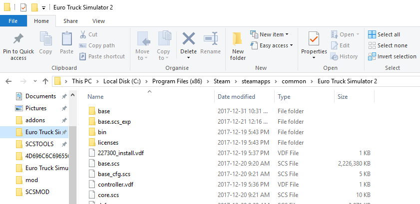
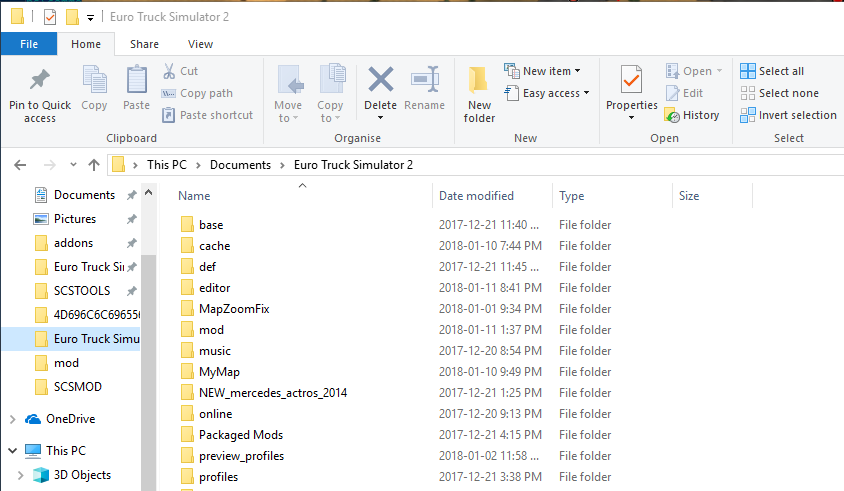

## Editing in the Fast Lane

The conventional wisdom, as discussed in [Testing Your Mod](3_testing.md), is that you must exit the game after saving your map, repackage/reload the mod,
and restart the game.

However, if you'd like to skip these steps, there is a way.  Recall that there are two essential folders in the SCS game world.  One we'll 
call **INSTALL** -- that's the folder where the ETS2 or ATS binaries and base files were installed.  It looks like this:

The other we'll call **USER**.  That's the one where you keep your profiles, your mod folder, and other stuff specific to your personal install of the game.  It looks like this:

If you want to avoid the quit/repack/reload/start cycle, here's how.

In your **USER/mod** folder, make a folder called *YourMapName* (for easier repackaging later, you probably want to make this name match your map file name, but actually you can call it anything you like -- see below).

Within this **USER/mod/*YourMapName*** folder, make a LINK to **INSTALL/base/map**

If you do this right, then when you go to **USER/mod/*YourMapName*/map**, you will find yourself in **INSTALL/base/map** ... and you can edit, save, run, and edit again without ever leaving the Map Editor.

If you are a n00b (or a prolific mod developer), you might be editing more than one map at a time.  You might have saved more than one *YourMapName*.mbd file and *YourMapName* folder in **INSTALL/base/map** -- I,for example, have a Map1 and a Map2 and will probably have more, as I make small standalone maps to try out different methods & learn specific things.  That doesn't matter.  If you are working on more than one map mod, just give it a different name for editing and saving.  It will get saved in the same location

Example:  Let's say I'm just learning the editor, and I have 2 tutorial projects going on:  Map1 and Map2.  I use *edit Map1* or *edit Map2* to work on them, and they get saved to the **INSTALL/base/map** folder.  So in that folder I see

To avoid the pesky quit/repack/restart cycle, I p

Making these links in Windows is not as straightforward as I'm used to (coming from 'nix territory).  You might be able to use mklink, or the extension HardLinkShellExt_64, or the Windows Power Shell "new item" command.  Here's a thread that covers the topic.  Good luck!

https://superuser.com/questions/1020821/how-to-create-a-symbolic-link-on-windows-10

If you do this right, you should be able to Save your map periodically and test it with Run, without exiting the game and repackaging as a mod file in between.

