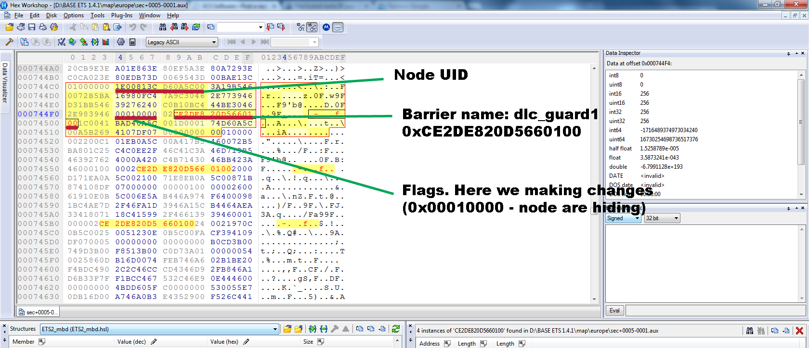

## Power Mapping

There is no "Advanced" section in this manual, but this chapter is about as close as we get to one.  If you are a novice mapper, it would be a good idea to go through the earlier chapters -- and do some practise mapping -- before you read this part.

```
PACKAGING

	how to save only changed sectors


CUTPLANES

	growing shrinking mountains
	what is KDOP
  
  ADVANCED MAPPING

	background image and map scaling
	understanding map scale
	how to build a hill
	internationalizing city names
	how to make standalone map
	hookups and overlays
	what is an Atlas
	removing game's collision barriers to extend stub roads

```

## Remove Invisible Barriers

WARNING:  this is not an errand for the faint-hearted.  You need to have a binary editor and know how to use it.

Still want to proceed?  Follow this example:

This barriers names as "dlc_guard1" and "dlc_guard2". Their codenames are 0xCE2DE820D5660100 and 0xCE13EF7F18FD0100.

1.) Open .aux file for sector, where is placed that barrier and find one of this codenames.
2.) Move backwards on 53 bytes
3.) This 8 bytes are UID
4.) In map editor find that UID ('f' key')
5.) If this is the object we are looking for, we must back to hex-editor 
6.) Five bytes before codename are object/node flags
7.) Change this value to standard-like value (ex. 0x01000000)
8.) Save file and put it in to .zip/.scs mod :)


