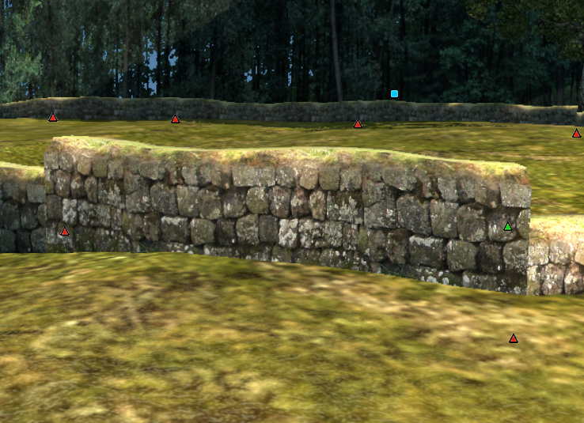

## Tips & Tricks for Intermediate Mappers

### the most important tip/trick

*Always*, the single most instructive thing you can do is to open an existing map that you admire, teleport to an area of interest, and take a close look at it -- figure out how it was done.  This will expand your skills more than any amount of manual reading!  An example is worth more than a thousand words.

### copy and paste for efficient editing

If you're re-using a favourite set of objects, you can always instantiate all of them them somewhere -- behind a cutplane for example, so you won't see the clutter in free cam view -- and copy/paste them as needed, instead of having to reselect from the Content Browser or long unwieldy menus.

You can do a lot more with Copy and Paste.  If you've designed one quadrant of a complex interchange you can copy the whole shebang, paste it, rotate/reflect it, and 90 percent of the work is done for the opposing quadrant.  Also, suppose you have created a cleverly shaped fence line between fields and you want some vegetation to follow the fence line (imitating real life):  copy the fence line, paste it somewhere, and change the object to a different Building (Series) type object like grass, shrubs, bushes.  You will instantly have a perfect duplicate of your fence line, made of vegetation, which you just have to drag into place.  Formal landscaping also become easy when you can reflect, rotate, and transpose pasted Building objects like hedges.

### reflections

Ever noticed when playing the game that some bodies of water look flat and don't reflect objects across the water from you, whereas others look realistic and do reflect landscape and objects?  You might thing that the trick here is to find a "reflective" property of the water plane.  But actually, the reflectivity is a property of the objects being reflected!  Look in the Properties dialogue popup for "Water Reflection" and turn it on if you want the object to cast a reflection in any nearby water plane.

Why is this a property of the reflected object rather than the reflecting surface?  Because this enables you to decide how many objects you want reflected.  You can ignore distant objects for example, so that the game engine doesn't waste resources calculating reflection for stuff that would be just a dim blur anyway.  You can reflect selected objects only, for a "quick look" that's convincing without a lot of overhead.  It's a performance tuning feature.

### brush limitations

Sorry, Brush doesn't work on prefabs.  Also, the minimum brush tile size is what it is.  You can't make it smaller.

### use Properties panel features for efficient editing

Be aware of that "Default" button at the bottom of Properties panel.  If you will repeatedly use a certain style of road segment or other object, set it as the Default.  Then when you go into E (extend or add) mode, and select that object type, the Default that you saved will automatically be loaded for use.  You can also save a Properties configuration as a named Preset.  Using these features will speed up your editing significantly.

### wrangling your Building (series) objects

To add a node in between two existing nodes in a Building (series) object or road segment, use Middle Mouse Click.

To delete a node from a Building or Road object, use Ctrl-Alt-Middle-Mouse-Click.  This doesn't always work, but it's worth a try.  If it fails, you can delete the segment and then drag the cut ends back together.

Sometimes Building (series or string) objects don't "fall" properly when you use F6.  And sometimes, when you create new nodes in a Building object, the newly created segment doesn't line up with the rest -- it may be high or low or otherwise conspicuously wrong, like this:

The solution is to pop up the Item Properties (P, then click on item) and choose the "reset offsets" action.  This should tame your misbehaving Building object.

### importing a map

