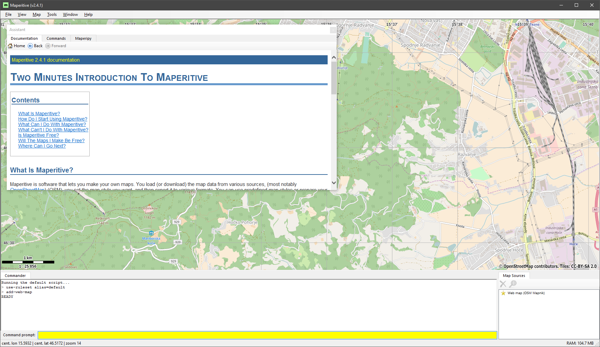
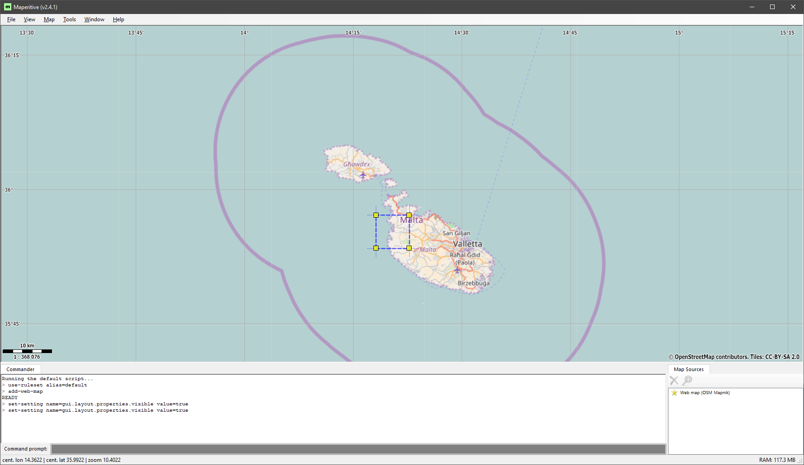
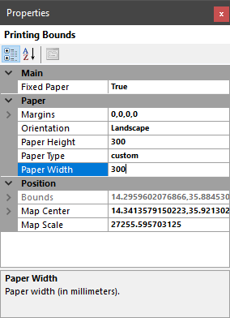
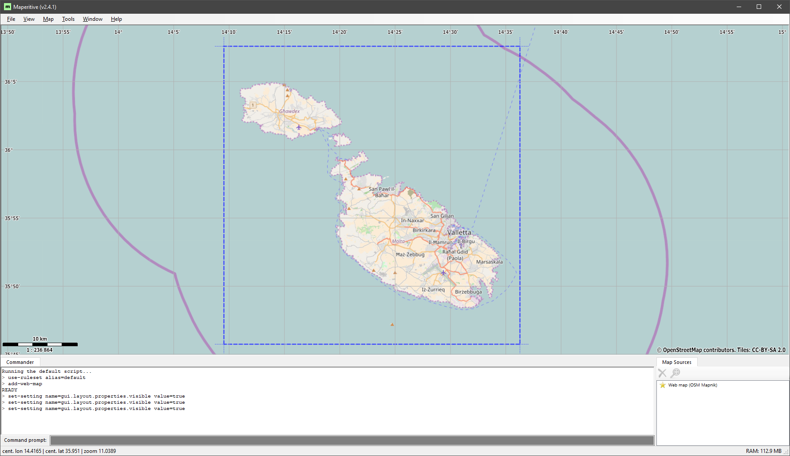
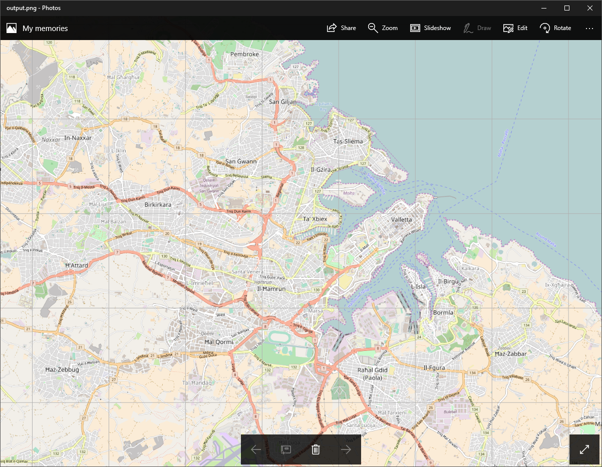
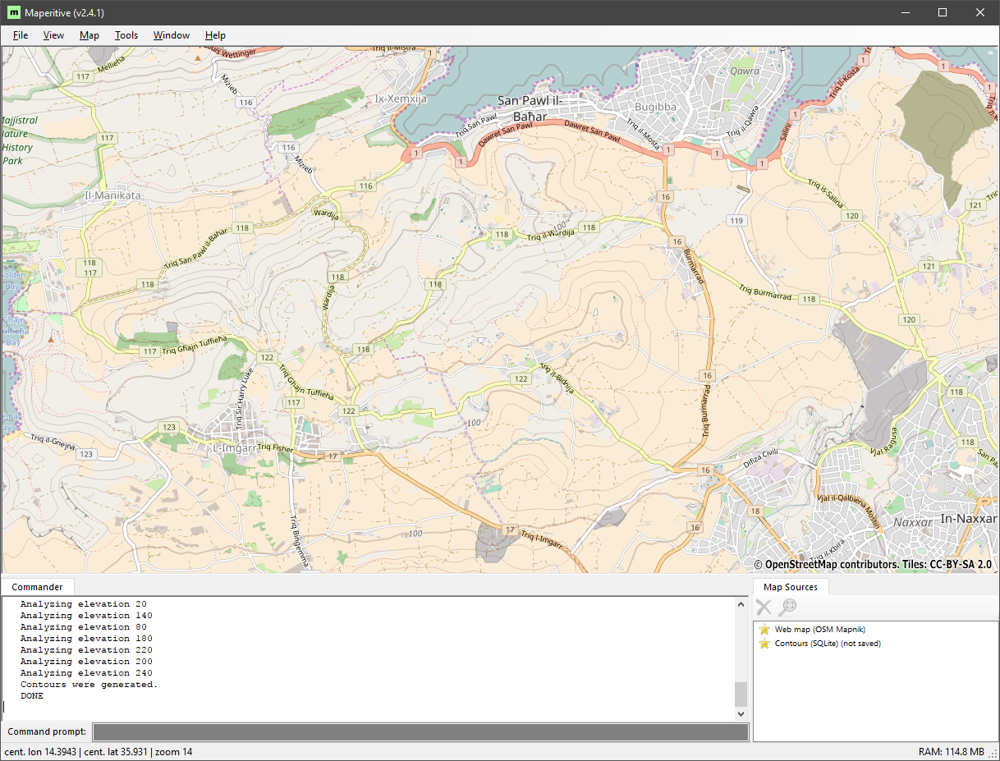

# Editor backgrounds for custom modules

This tutorial teaches you how to make a custom editor background, the reference map image that appears in the editor when you press 'A'.

This part will describe a method for getting high-resolution map imagery from [OpenStreetMap](https://www.openstreetmap.org/about). If you're happy with the one you have, or have made a custom map for a fictional region, you can skip ahead to [Part 2](#).

1. [OpenStreetMap & Maperitive](#section1)
2. [Selecting an Area](#section2)
3. [Exporting the Image](#section3)


- [Appendix: Additional Maperitive features](#appendix)


<a name="section1"></a>
## 1. OpenStreetMap & Maperitive

[OpenStreetMap](https://www.openstreetmap.org) (OSM) is an online map service, similar to Google, Bing or Apple Maps. Unlike other services, OSM's data is fully open, which means there are many services available to grab and render images.

[Maperitive](http://maperitive.net/) is one such tool, a desktop application which can download and render OSM data. We'll be using this to output a high-resolution image from the OSM web map.

Download the latest Maperitive ZIP, and extract the archive. There is no installer for the program, so it can be placed wherever you prefer. Open ```maperitive.exe``` to begin the program.



<a name="section2"></a>
## 2. Selecting an Area

You're currently seeing the same web 'tiles' as on openstreetmap.org, zoom out using the mouse wheel, then pan to your chosen area by clicking and dragging the map.

For this tutorial, we'll be preparing to create a map of the Republic of Malta at a 1:5 scale. At this scale, travelling from the north-west to the south-east of the two islands will be similar to the distance between Amsterdam and Brussels in Euro Truck Simulator 2 (which is 1:19 in mainland Europe).

Find Malta on the map, then **right-click** on the map and select _Place Printing Bounds Here_. These printing bounds are the border of what will be our output image.



The resulting textures should have a square (or half-square) aspect ratio, so we will force the aspect ratio of this printing bound. **right-click** on the bounds and click properties.

We need to tell Maperitive that we are printing on a square page to force the aspect ratio. **Change** the following properties in the properties window.

| **Property** | **Value** |
| --- | --- |
| Fixed Paper | True |
| Paper Type | custom |
| Paper Height | 300 |
| Paper Width | 300 |



Your map bounds should now have a locked ratio. drag them to surround the landmass, leaving a small margin probably isn't a bad idea. **Disable** fixed paper once you've set your bounds. Otherwise we won't be able to set a custom image resolution for our export.

<a name="section3"></a>
## 3. Exporting the Image



Once you're happy with the bounds, you can then export the image. ```Tools > Export To Bitmap``` is good for a quick preview, but defaults to a low resolution.

To get a larger image out, we'll need to use a command-line command. This isn't too difficult though, as maperitive includes a command prompt at the bottom of the window, the box that is either yellow or dark grey.

**Type** the following command in the box and then press enter.

```
export-bitmap width=4096
```
_More image export settings can be found [here](http://maperitive.net/docs/Commands/ExportBitmap.html)._

The program will take a short time to download and combine the higher-detail map tiles, but should eventually produce an image in the ```.\Maperitive\output\``` folder.

Perhaps due to distortions in the map projection, maperitive doesn't seem to produce images that precisely match the aspect ration we stated earlier. You will need to follow the resizing instructions in the next part.



<a name="appendix"></a>
## Appendix. Additional Maperitive features

### Export options

Additional parameters for the export-bitmap command can be found [here](http://maperitive.net/docs/Commands/ExportBitmap.html).

### Height Data

It may be helpful to add height data to your overlay image. The easiest way to do this is by adding contours.

Right-click the map and place the geometry bounds. Drag to resize the geometry bounds, making sure they're at least as large as printing bounds. Then, simply go to ```Tools > Generate Relief Contours```. Your map contours should now appear, you can then re-export the map bitmap.



[<- Back to Index](../index.md) --- [Editor backgrounds for custom modules (Part 2) ->](2_import.md)
