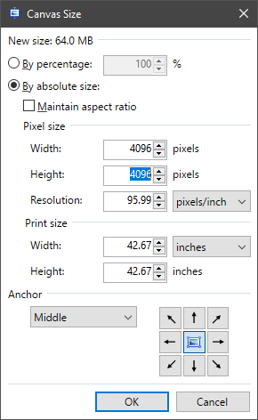
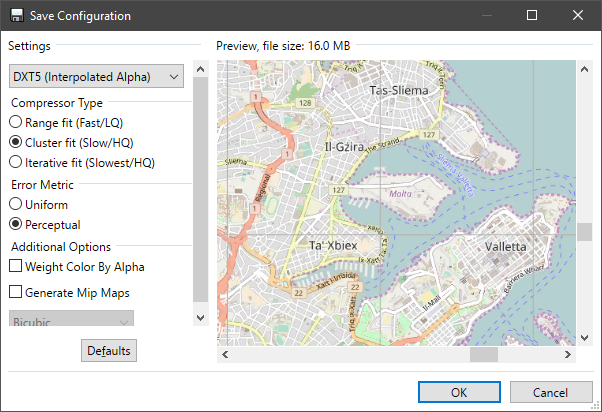
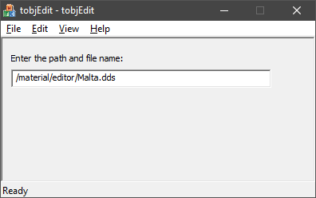
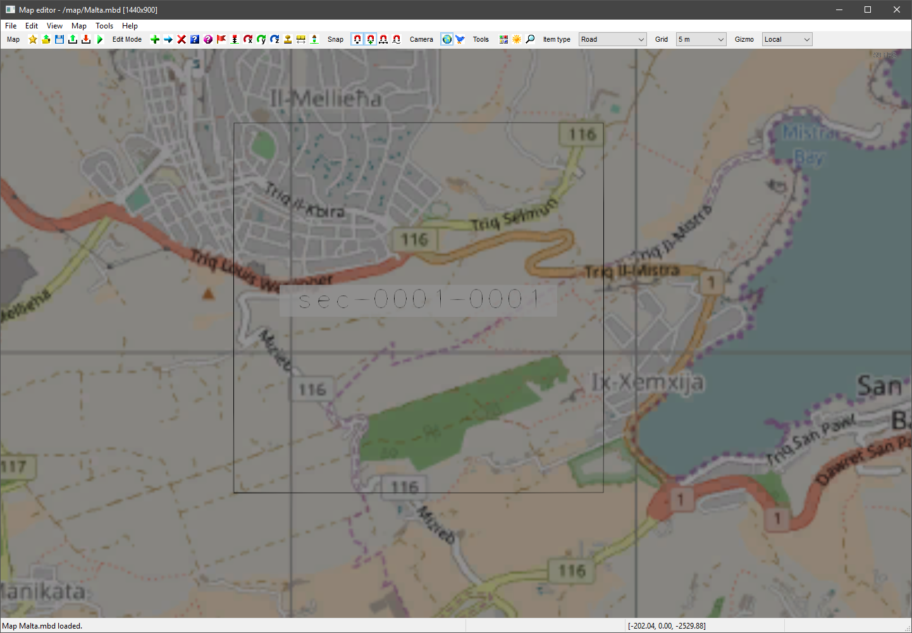
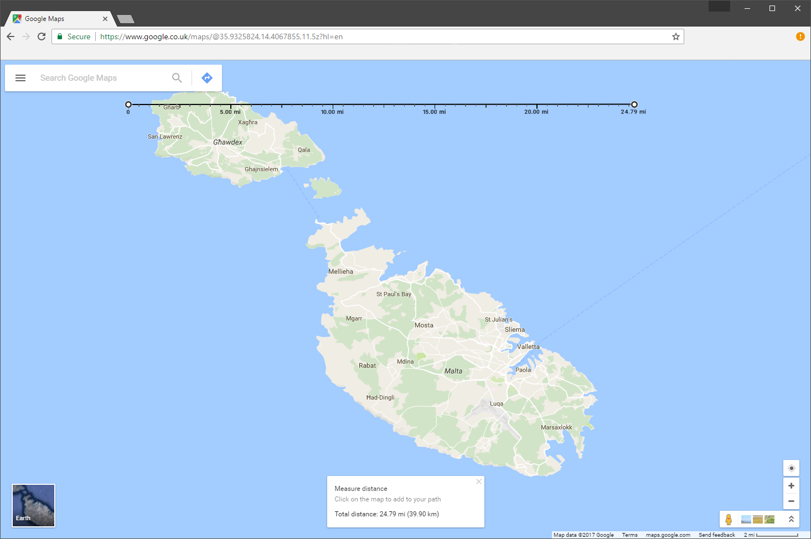
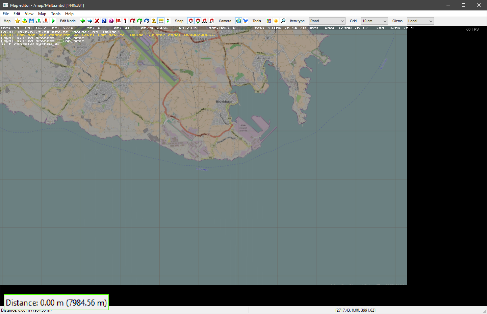

# Editor backgrounds for custom modules

This tutorial teaches you how to make a custom editor background, the reference map image that appears in the editor when you press 'A'.

This part will describe how to take a map image and import it into the SCS Editor. A technique for getting high-resolution map images can be found in [part 1](1_imagery.md).

### Contents

1. [Create an empty map](#section1)
2. [Image size & format](#section2)
3. [Creating the material files](#section3)
4. [Modifying the editor data](#section4)
5. [Calculating the correct scale](#section5)

### Software Required

- An image editor with DDS format support.
  * [NVIDIA plugin](https://developer.nvidia.com/nvidia-texture-tools-adobe-photoshop) for Adobe Photoshop
  * [Paint.NET](http://www.getpaint.net/index.html) (shown in tutorial)
  * The [GNU Image Manipulation Program](https://www.gimp.org/)
- A text editor that is slightly better than Windows' notepad.
  * [Notepad++](https://notepad-plus-plus.org/) is a popular choice.
  * [Atom](https://atom.io/) is used to write this guide, but it's mostly useful for large projects.
- An editor for the ```.tobj``` format
  * [tobjEdit](http://www.mediafire.com/?zxlf5ta0ot7h0l1)* (shown in tutorial)
  * If you use Python, [this script](https://gist.github.com/SecretImbecile/5e630d206db109685842b503903d371b) has been written by the author to create .tobj files.
- You may need the official [game archive extractor](http://modding.scssoft.com/wiki/Documentation/Tools/Game_Archive_Extractor#Download) to obtain a current version of ```editor_data.sii```

_* Editor's note: tobjEdit originates from [haulinmods.com](http://www.haulinmods.com/), and is currently unsupported. In case this file is lost from its current host, I have mirrored the file [here](https://drive.google.com/open?id=0B1SFjX5JrmNUhpdXU1SG9TRjg)._

<a name="section1"></a>
## 1. Create an empty map

First, create a new mod folder for this project. As usual, for this tutorial I shall place the folder on ```C:\Users\<username>\Desktop```. Because we created map imagery for the Republic of Malta in part 1, we will be naming this folder ```Malta```.

Editor backgrounds are specific to each map, so we need to create a blank map to start our mod.
- Launch the editor
- Place at least a single road segment
- Save a map as ```Malta```
- Copy ```Malta.mbd``` and the ```Malta``` folder from your game ```base\map``` folder
- create a ```map``` folder in your mod folder and paste the map files.

<a name="section2"></a>
## 2. Image size & format

The editor background image needs to be a DDS format image with width and heights that are both divisible by 4. Because our image is square, we'll use the game texture convention of using square numbers. (i.e. 512, 1024, 2048, 4096)

Whilst images of 8192x8192 should work, I have experienced issues loading such large images in the editor, so you should use a 4096x4096 image to begin with before trying a larger image.

Ensure that that the exported DDS file fits the dimension requirements, and is exported as DXT5. Mipmaps are not necessary for the image.




You should now have a compatible image. You can copy our version from the GitHub repo [here](#).

<a name="section3"></a>
## 3. Creating the material files

Create a new mod folder (the working folder you create the .scs file from) called ```Malta``` and create a ```material\editor``` folder inside it. Paste your map DDS image in this folder. The name in this example is ```Malta.dds```.

as well as the image file itself, we also need:

- A texture information file
- A Material definition file

### Texture information file

Open tobjEdit and type the path from the game base folder to the image file, which for our editor background is ```/material/editor/Malta.dds``` (with forward slashes). ```File > Save As...``` the .tobj file to the same folder as the map image.

 

### Material definition file

With your chosen text editor, copy the text below into a new file, then save this file as ```Malta.mat``` in the same folder as the image and definition files.

```
material : "dry.tex"
{
	texture : "Malta.tobj"
	texture_name : "texture"
}
```

<a name="section4"></a>
## 4. Modifying the editor data

This material will be loaded alongside the existing editor backgrounds, so we now need to tell the editor to load this material. The file ```base/def/editor_data.sii``` manages which backgrounds are loaded, so we will make a copy of this file in our mod.

You should be able to use the copy of the file shown below, but if this breaks in later versions, you should use the SCS archive extractor to get the up-to-date copy.

```
SiiNunit
{
editor_data : .edit_data {

	autosave_interval: 15 #minutes
	autosave_notify_interval: 10 #seconds

	startpos_model: "/vehicle/ai/focus_2009/lod.pmd"
	startpos_rotate_speed: 16.0

	stamp_count_warning: 40
	road_length_warning: 330

	free_camera_uplift: 8.5
	sub_mode_types[]: 1 #terrain_item
	sub_mode_types[]: 3 #road_item
	sub_mode_types[]: 4 #prefab_item
	sub_mode_types[]: 2 #buildings_item"
	sub_mode_types[]: 5 #model_item"
	sub_mode_types[]: 36 #sign_item"
	sub_mode_types[]: 15 #animated_model_item"
	sub_mode_types[]: 28 #walker_item"
	sub_mode_types[]: 34 #trigger_item"
	sub_mode_types[]: 8 #cut_plane_item"
	sub_mode_types[]: 9 #mover_item"
	sub_mode_types[]: 12 #city_item"
	sub_mode_types[]: 11 #no_weather_item"
	sub_mode_types[]: 13 #hinge_item"
	sub_mode_types[]: 18 #map_overlay_item"
	sub_mode_types[]: 21 #sound_item"
	sub_mode_types[]: 19 #ferry_item"
	sub_mode_types[]: 23 #camera_point_item"
	sub_mode_types[]: 38 #traffic_area_item"
	sub_mode_types[]: 39 #bezier patch"
	sub_mode_types[]: 42 #map_area_item

	map_import_offset: (-43402, 0, -28089)

	bcg_map_name[]: "/map/europe.mbd"
	bcg_material[]: "/material/editor/europe.mat"
	bcg_size_x[]: 207656
	bcg_size_y[]: 174375
	bcg_offset_x[]: 10500
	bcg_offset_y[]: -7090

	bcg_map_name[]: "/map/europe_fr.mbd"
	bcg_material[]: "/material/editor/europe.mat"
	bcg_size_x[]: 207656
	bcg_size_y[]: 174375
	bcg_offset_x[]: 10500
	bcg_offset_y[]: -7090

@include "/custom/editor_data.sii"

}
}
```

Create a ```def``` folder inside your mod folder and save this file as ```editor_data.sii```. Then, change the settings of the ```"/map/europe_fr.mbd"``` block to our own settings. (this appears to be a reference to the internal development version of the _Vive la France !_ DLC, so isn't being used)

We will point to the map and material that we have set up for this mod, and place a temporary scale on our map, which we will calculate shortly.

```
bcg_map_name[]: "/map/Malta.mbd"
bcg_material[]: "/material/editor/Malta.mat"
bcg_size_x[]: 100000
bcg_size_y[]: 100000
bcg_offset_x[]: 0
bcg_offset_y[]: 0
```

### Testing

At this point you should have the following files in your mod folder

```
Malta
        def
                editor_data.sii
        map
                Malta
                Malta.mbd
        material
                editor
                        Malta.dds
                        Malta.mat
                        Malta.tobj
```

Try compiling an .scs archive now and loading into the editor with ```edit Malta```, then press A to view the background.

Common errors at this point are usually a case mismatch on filenames (```malta.dds``` vs ```Malta.dds```), or using backslashes on directory links (```folder\subfolder``` vs ```folder/subfolder```).



<a name="section5"></a>
## 5. Calculating the correct scale

The ```bcg_size_x``` and ```bcg_size_y``` values are the total size of the map background in _meters_. You may, if you wish, be able to calculate the precise dimensions of your map using a [bearing to distance calculator](http://www.nhc.noaa.gov/gccalc.shtml), but unless you want to work in a correct 1:1 scale, it's probably good enough to just estimate the distance.

I used the measure tool on Google Maps (right-click) to measure the full width my map image covers. This measured pretty close to 40km. Because our map is square ratio, I'll use this length for both the x and y values.



Remember that we said we'd be creating our map in 1:5 scale, so our final value will be ```40km/5 = 8000m```. Hence:

```
bcg_map_name[]: "/map/Malta.mbd"
bcg_material[]: "/material/editor/Malta.mat"
bcg_size_x[]: 8000
bcg_size_y[]: 8000
bcg_offset_x[]: 0
bcg_offset_y[]: 0
```

recompile your mod archive and load the editor again. Use the _Ruler_ mode to confirm that the map is the correct scale.



[<- Editor backgrounds for custom modules (Part 1)](1_imagery.md) --- [Back to Index ->](../index.md)
